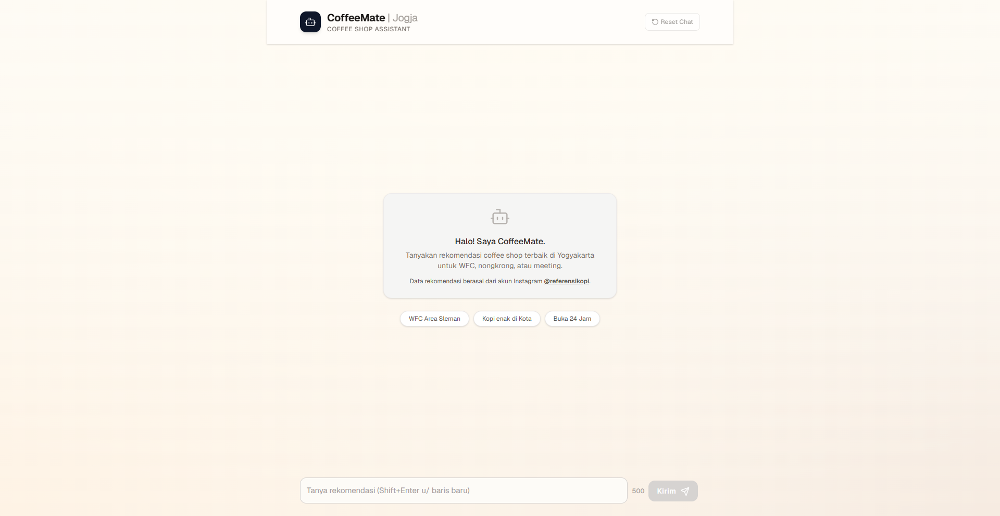

# CoffeeMate RAG System

Sistem tanya-jawab dan rekomendasi coffee shop berbasis RAG (Retrieval-Augmented Generation) untuk wilayah Yogyakarta, menggunakan data Instagram sebagai basis pengetahuan.

> Data source utama: scraping akun Instagram [@referensikopi](https://www.instagram.com/referensikopi/).

## Quick Links

| Item | Link |
| --- | --- |
| Live Web UI | https://mycoffeemate.vercel.app/ |
| Dokumentasi Kode | `docs/CODE_DOCUMENTATION.md` |
| Deployment Plan | `docs/WEB_UI_DEPLOYMENT_PLAN.md` |
| Migrasi Backend VPS | `docs/VPS_BACKEND_MIGRATION.md` |

## Web UI Preview



## Ringkasan Produk

Pengguna dapat bertanya dengan bahasa natural, misalnya:
- "Rekomendasi coffee shop untuk WFC di Sleman"
- "Tempat dengan suasana tenang dan menu kopi susu"

Sistem akan:
1. Mengambil dokumen paling relevan dari vector store.
2. Menyusun konteks berbasis metadata dan deskripsi tempat.
3. Menghasilkan jawaban dengan sumber yang bisa ditelusuri.

## Fitur Utama

| Area | Fitur |
| --- | --- |
| Retrieval | ChromaDB + embedding Jina (`jina-embeddings-v5-text-small`) |
| Generation | Groq LLM (`llama-3.3-70b-versatile`) |
| Backend API | FastAPI endpoint `POST /api/chat` |
| Frontend | Next.js App Router + server-side proxy route |
| Runtime fallback | Auto rebuild vector store saat storage kosong |
| Security | Bearer token opsional, rate limit per menit, daily cap per IP, CORS allowlist |

## Arsitektur Request

```text
Browser UI
   |
   v
Next.js Route (/api/chat)
   |
   v
FastAPI Backend (auth + usage guard)
   |
   v
RAGService
  |- Retriever (Chroma)
  |- Generator (Groq)
   |
   v
Answer + Sources
```

## Stack Teknologi

- Backend: FastAPI, Pydantic, LangChain, ChromaDB
- Embedding: Jina Embeddings API
- Generation: Groq API
- Frontend: Next.js
- Data processing: pandas

## Struktur Direktori

```text
backend/
  config/settings.py
  src/
    rag_service.py
    retriever.py
    generator.py
    ingest.py
    embed.py
  web_api/
    main.py
    security.py
frontend/
  app/api/chat/route.ts
scripts/
  cli.py
  reingest.py
docs/
  CODE_DOCUMENTATION.md
  WEB_UI_DEPLOYMENT_PLAN.md
experiments/notebooks/
  README.md
```

## Konfigurasi Environment

### Root `.env`

| Variable | Wajib | Keterangan |
| --- | --- | --- |
| `GROQ_API_KEY` | Ya | API key untuk LLM generation |
| `JINA_API_KEY` | Ya | API key untuk embedding |
| `API_ACCESS_TOKEN` | Tidak | Token auth backend jika ingin endpoint diproteksi |
| `RATE_LIMIT_PER_MINUTE` | Tidak | Batas request per menit per IP |
| `DAILY_REQUEST_LIMIT_PER_IP` | Tidak | Batas request harian per IP |
| `ALLOWED_ORIGINS` | Tidak | Daftar origin frontend yang diizinkan |

### Frontend `frontend/.env.local`

| Variable | Keterangan |
| --- | --- |
| `BACKEND_API_URL` | URL endpoint backend `/api/chat` |
| `BACKEND_API_TOKEN` | Isi sama dengan `API_ACCESS_TOKEN` jika auth aktif |

## API Kontrak

### `GET /health`

Digunakan untuk cek status readiness backend.

### `POST /api/chat`

Request:

```json
{
  "question": "Rekomendasikan coffee shop untuk WFC di Sleman"
}
```

Response:

```json
{
  "answer": "....",
  "sources": [
    { "nama": "@akun_ig", "lokasi": "Sleman" }
  ]
}
```

## Setup Singkat

```bash
pip install -r requirements.txt
cd frontend && npm install
```

Jalankan backend dan frontend:

```bash
uvicorn backend.web_api.main:app --reload
cd frontend && npm run dev:3010
```

## Operasional Lokal

Mode CLI:

```bash
python scripts/cli.py
```

Rebuild vector store:

```bash
python scripts/reingest.py
```
